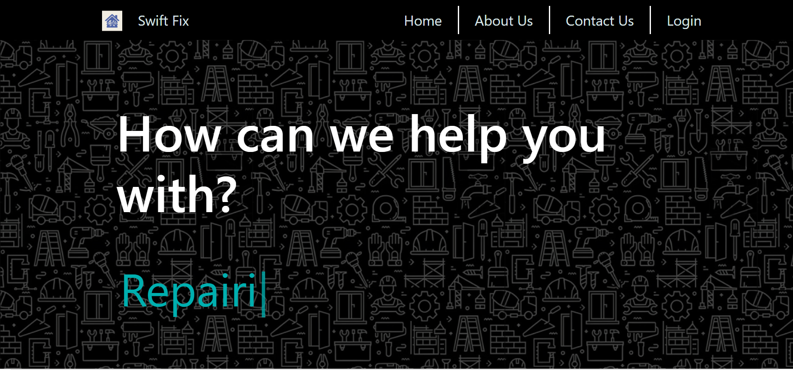
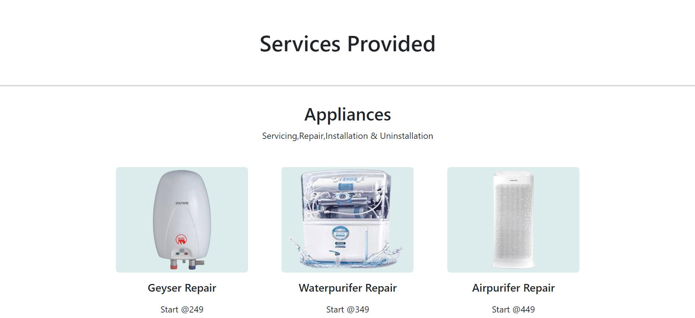
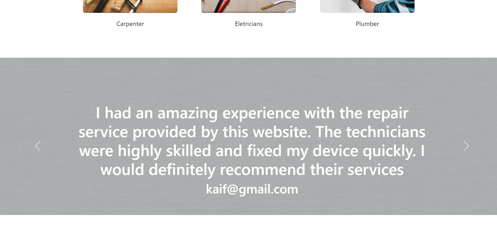
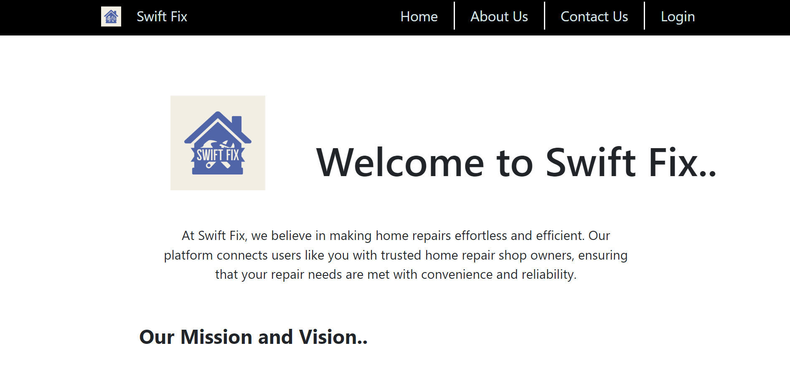
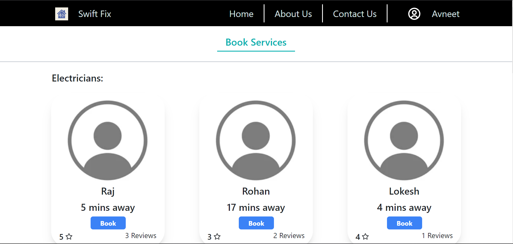
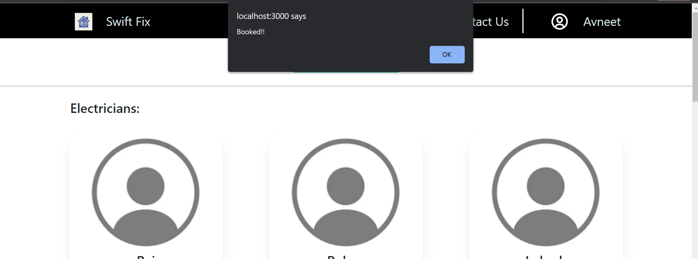
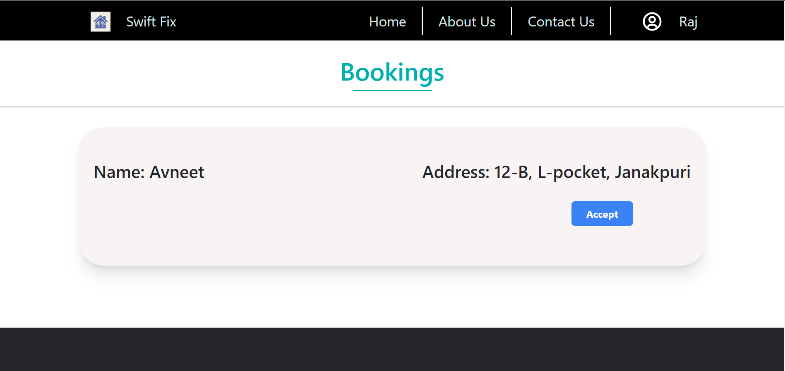
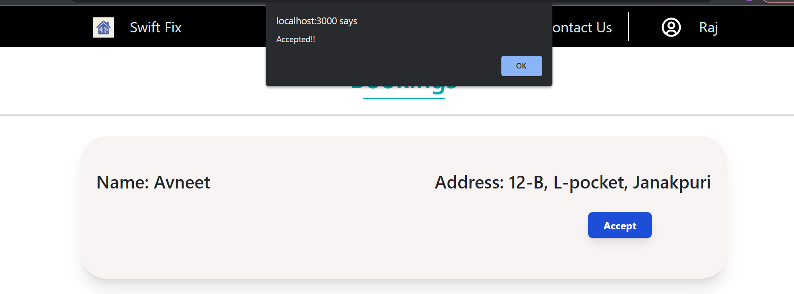

# SWIFT FIX


At Swift Fix, we believe in making home repairs effortless and efficient. Our platform connects users like you with trusted home repair shop owners, ensuring that your repair needs are met with convenience and reliability.  

Home repairs can often be a cumbersome and time-consuming task for homeowners. Finding reliable and skilled local shop owners who can efficiently carry out the required repairs can be a significant challenge.


## Features

- Displaying all Services.
- User can book Services.
- Services provider can see who booked services.
- Service provider can provide services.

## Modules
- User login.
- Service Provider login.
- Add and Update Services.
- Book servicse.
## Technology Stack Used


- Front End - HTML, CSS, JavaScript, React.
- Backend - Nodejs, Expressjs.
- Database - Mongodb.
## Requirements

- The source code of this project is written in Node js. So, you'll require Node preinstalled to run this project.
## Run Locally

Clone the project

```bash
  git clone https://github.com/kaif-stack/TechTitans.git
```

Go to the project directory

```bash
  cd client
  cd server
```

Install dependencies

```bash
  npm install
```

Create a .env file. then, declare this variable in .env file

```bash
  Password = "Write your password"
```

Start the server

```bash
  npm start
```

## Website Walkthrough











[Video](https://youtu.be/SjOlMeXPTTY)


## The Tech Titans

[Aniket Goyal](https://www.linkedin.com/in/aniketgoyal110903/)  - Full Stack Developer\
[Avneet Singh](https://www.linkedin.com/in/avneet-singh-7758a1227/)  - Full Stack Developer\
[Mohd Kaif](https://www.linkedin.com/in/mohd-kaif-7ba250228/)  -  Full Stack Developer
